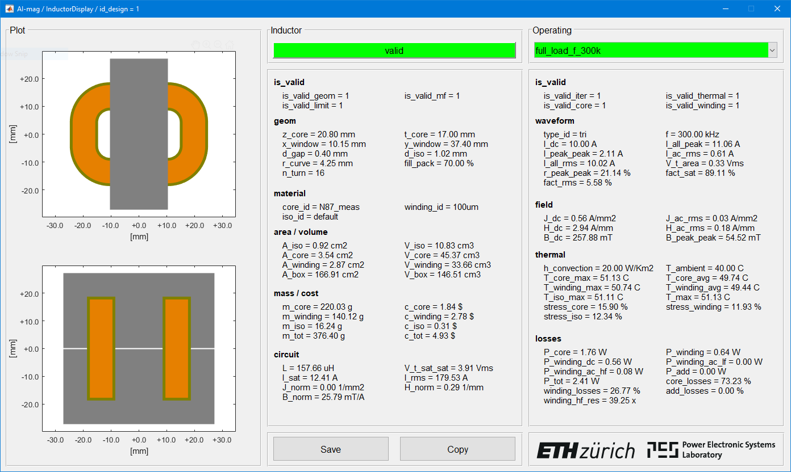
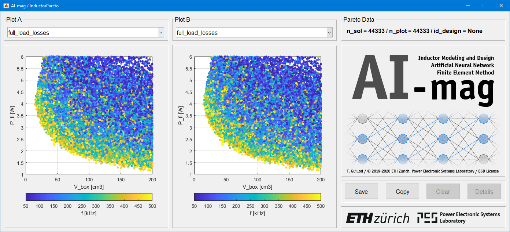

# AI-mag: Tutorial

## Goal

This is a simple example how to design an inductor:
* Design computation and optimization
* Result analysis
    * Interactive GUI
    * Pareto fronts exploration

The following inductor is considered.
* Non-solated DC-DC Buck converter
* Converter ratings: 2kW, 400V input voltage, 200V output voltage
* Optimized parameters : frequency, geometry, air gap, number of turns, ripple

## Installation

> **WARNING**: The repository does NOT contain the dataset and the trained ANNs.
> **WARNING**: The dataset and the trained ANNs are only included in the releases.

* Go to the latest release: [download](https://github.com/ethz-pes/AI-mag/releases/latest)
* Download the source code: "Source code (zip)" or "Source code (tar.gz)"
* Unpack the source code
* Download the data: "data.zip" or "data.tar.gz"
* Unpack the data (replace the folder "dataset" and "design")
* Start MATLAB and go to the corresponding folder
* Type "init_toolbox" to load the toolbox

## Run a Single Inductor Design

```
>> run_design_compute_single
  ________________________________________________________
 |       _________   ___                                  |
 |      /  ___   /  /__/         _ __ ___   __ _  __ _    |
 |     /  /__/  /  /  /   ___   | `_ ` _ \ / _` |/ _` |   |
 |    /  ___   /  /  /   /___|  | | | | | | (_| | (_| |   |
 |   /__/  /__/  /__/           |_| |_| |_|\__,_|\__, |   |
 |                                               |___/    |
 |________________________________________________________|
 |                                                        |
 |   Fast and Accurate Inductor Modeling and Design       |
 |   With Artificial Neural Network (ANN)                 |
 |   With Finite Element Method (FEM)                     |
 |________________________________________________________|
 |      ____________________   ___                        |
 |     /  ________   ___   /__/  /   ETH Zurich           |
 |    /  _____/  /  /  /  ___   /    Power Electronic     |
 |   /_______/  /__/  /__/  /__/     Systems Laboratory   |
 |________________________________________________________|
 |                                                        |
 |   T. Guillod, Power Electronic Systems Laboratory      |
 |   Copyright 2019-2020 ETH Zurich / BSD License         |
 |________________________________________________________|
 
Select the simulation type:
    1 - ANN-based model
    2 - Analytical approximation
    2 - FEM simulation (require COMSOL Livelink)
Enter your choice >> 1

################## master_compute_single
load
ann fem
run
info
    single design
    diff = 00:00:00
save
################## master_compute_single
################## master_plot_single
load
gui
################## master_plot_single
```

<p float="middle">
    
</p>

## Run a Pareto Fronts

```
>> run_design_compute_pareto
  ________________________________________________________
 |       _________   ___                                  |
 |      /  ___   /  /__/         _ __ ___   __ _  __ _    |
 |     /  /__/  /  /  /   ___   | `_ ` _ \ / _` |/ _` |   |
 |    /  ___   /  /  /   /___|  | | | | | | (_| | (_| |   |
 |   /__/  /__/  /__/           |_| |_| |_|\__,_|\__, |   |
 |                                               |___/    |
 |________________________________________________________|
 |                                                        |
 |   Fast and Accurate Inductor Modeling and Design       |
 |   With Artificial Neural Network (ANN)                 |
 |   With Finite Element Method (FEM)                     |
 |________________________________________________________|
 |      ____________________   ___                        |
 |     /  ________   ___   /__/  /   ETH Zurich           |
 |    /  _____/  /  /  /  ___   /    Power Electronic     |
 |   /_______/  /__/  /__/  /__/     Systems Laboratory   |
 |________________________________________________________|
 |                                                        |
 |   T. Guillod, Power Electronic Systems Laboratory      |
 |   Copyright 2019-2020 ETH Zurich / BSD License         |
 |________________________________________________________|
 
Select the simulation type:
    1 - ANN-based model
    2 - Analytical approximation
Enter your choice >> 1

################## master_compute_pareto
load
ann fem
sweep
split
run
    6 / 6
    5 / 6
    4 / 6
    3 / 6
    2 / 6
    1 / 6
assemble
info
    diff = 00:00:20
    n_tot = 519683
    n_filter_var = 519683
    n_filter_fom = 120399
    n_sol = 44333
save
################## master_compute_pareto
################## master_plot_pareto
load
gui
################## master_plot_pareto
```

<p float="middle">
    
</p>
